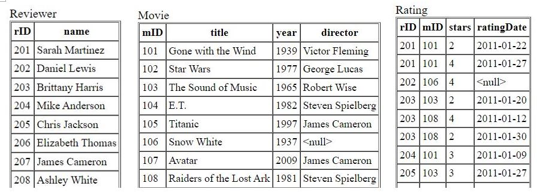

# SQL Social-Network Query Exercises

Introduction of Scenario: You've started a new movie-rating website, and you've been collecting data on reviewers' ratings of various movies. There's not much data yet, but you can still try out some data modifications. Here's the schema:

##  Database 

- Movie ( mID, title, year, director )

There is a movie with ID number mID, a title, a release year, and a director.

- Reviewer ( rID, name )

The reviewer with ID number rID has a certain name.

- Rating ( rID, mID, stars, ratingDate )

The reviewer rID gave the movie mID a number of stars rating (1-5) on a certain ratingDate.

# Query Exercises

Q1. Find all years that have a movie that received a rating of 4 or 5, and sort them in increasing order.

- [x] Answer:    
      
        SELECT distinct year
        FROM Rating,Movie
        WHERE Movie.mID = Rating.mID and Rating.stars > 3
        ORDER BY year;

Q2. Some reviewers didn't provide a date with their rating. Find the names of all reviewers who have ratings with a NULL value for the date.

- [x] Answer:    

        SELECT name
        FROM Reviewer  JOIN Rating
        ON Reviewer.rID = Rating.rID
        WHERE Rating.ratingdate is NULL;

Q3. Write a query to return the ratings data in a more readable format: reviewer name, movie title, stars, and ratingDate. Also, sort the data, first by reviewer name, then by movie title, and lastly by number of stars.

- [x] Answer:    
      
        SELECT  name, title, stars, ratingDate
        FROM Reviewer, movie, Rating
        WHERE Reviewer.rID = Rating.rID and Movie.mid = Rating.mid
        ORDER BY name, title, stars;

Q4. For every situation where student A likes student B, but we have no information about whom B likes (that is, B does not appear as an ID1 in the Likes table), return A and B's names and grades.

- [x] Answer:    

        SELECT  sq1.name, sq1.title
        FROM (( movie JOIN Rating ON Movie.MID = Rating.mid) 
                                  JOIN Reviewer ON Rating.RID = Reviewer.RID) as sq1,
            (( movie JOIN Rating ON Movie.MID = Rating.mid) 
                                  JOIN Reviewer ON Rating.RID = Reviewer.RID) as sq2
        WHERE sq1.name = sq2.name and sq1.mid = sq2.mid 
              AND sq1.ratingdate > sq2.ratingdate 
              AND sq1.stars > sq2.stars;

Q5. For each movie that has at least one rating, find the highest number of stars that movie received. Return the movie title and number of stars. Sort by movie title.

- [x] Answer:    
      
        SELECT title, max(stars) 
        FROM Movie as M, Rating as R 
        WHERE M.mID = R.mID 
        GROUP BY M.title

Q6. For each movie, return the title and the 'rating spread', that is, the difference between highest and lowest ratings given to that movie. Sort by rating spread from highest to lowest, then by movie title.

- [x] Answer:    

        SELECT title, max(stars) - min(stars) as spread
        FROM Movie, Rating
        WHERE Movie.mID = Rating.mID 
        GROUP BY title
        ORDER BY spread desc , title;

Q7. Find the difference between the average rating of movies released before 1980 and the average rating of movies released after 1980. (Make sure to calculate the average rating for each movie, then the average of those averages for movies before 1980 and movies after. Don't just calculate the overall average rating before and after 1980.)

- [x] Answer:    

        SELECT avg(B.prom) - avg(A.prom)
        FROM (SELECT R.mID, avg(R.stars) as prom 
              FROM Rating R, Movie M
              WHERE R.mID = M.mID and M.year <= 1980 
              GROUP BY R.mID) B, 
              (SELECT R.mID, avg(R.stars) as prom 
              FROM Rating R, Movie M
              WHERE R.mID = M.mID and M.year > 1980 GROUP BY R.mID) A

# Data Modification Exercises

Q1. Add the reviewer Roger Ebert to your database, with an rID of 209.

- [x] Answer:  

        INSERT INTO Reviewer
        VALUES(209,'Roger Ebert');

Q2. For all movies that have an average rating of 4 stars or higher, add 25 to the release year. (Update the existing tuples; don't insert new tuples.)

- [x] Answer:  

        UPDATE Movie
        SET year = year + 25
        WHERE mid in (SELECT mr.mid
                      FROM (Movie JOIN Rating on Movie.mid = Rating.mid) as MR 
                      GROUP by MR.mid
                      HAVING avg(MR.stars) >= 4)

Q3. Remove all ratings where the movie's year is before 1970 or after 2000, and the rating is fewer than 4 stars.

- [x] Answer:  

        DELETE from Rating
        WHERE (rid, stars, ratingdate) in (select tb2.rid, tb2.stars, tb2.ratingdate
                     FROM ((Reviewer join Rating on Reviewer.rid = Rating.rID) as tb1 join Movie on tb1.mid = Movie.mid) as tb2
                     WHERE (tb2.year > 2000 or tb2.year < 1970) AND	tb2.stars < 4)

