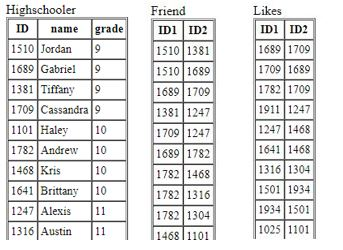
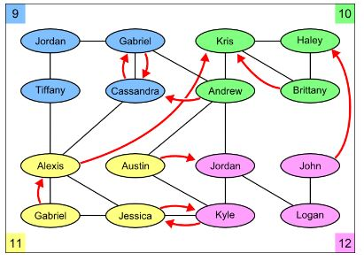

## SQL Social-Network Query Exercises

Introduction of Scenario: Students at your hometown high school have decided to organize their social network using databases. So far, they have collected information about students in four grades, 9-12. Here's the schema:

##  Database 

- Highschooler ( ID, name, grade )
There is a high school student with unique ID and a given first name in a certain grade.

- Friend ( ID1, ID2 )
The student with ID1 is friends with the student with ID2. Friendship is mutual, so if (123, 456) is in the Friend table, so is (456, 123).

- Likes ( ID1, ID2 )
The student with ID1 likes the student with ID2. Liking someone is not necessarily mutual, so if (123, 456) is in the Likes table, there is no guarantee that (456, 123) is also present.

Here is a graph showing the various connections between the students in our database:

## Exercises

Q1. Find the names of all students who are friends with someone named Gabriel.

- [x] Answer:    
      
        SELECT Highschooler.name
        FROM Highschooler
        WHERE Highschooler.ID IN (SELECT network.ID2
                                  FROM (Friend join Highschooler on Highschooler.ID = Friend.ID1) as network
                                  WHERE network.name = 'Gabriel' )

Q2. For every student who likes someone 2 or more grades younger than themselves, return that student's name and grade, and the name and grade of the student they like.

- [x] Answer:    

        SELECT H1.name, H1.Grade, H2.name, H2.grade
        FROM  (Likes JOIN Highschooler on Likes.ID1 = Highschooler.ID) as h1,
              (Likes JOIN Highschooler  on Likes.ID2 = Highschooler.ID) as h2
        WHERE h1.id1 = h2.id1 and h1.Grade - h2.grade >1

Q3. Find all students who do not appear in the Likes table (as a student who likes or is liked) and return their names and grades. Sort by grade, then by name within each grade.

- [x] Answer:    
      
         SELECT DISTINCT Highschooler.name, Highschooler.grade
         FROM Highschooler, Likes
         WHERE Highschooler.id not in (select id1 from likes)
                and Highschooler.id not in (select id2 from likes)
         ORDER BY grade

Q4. For every situation where student A likes student B, but we have no information about whom B likes (that is, B does not appear as an ID1 in the Likes table), return A and B's names and grades.

- [x] Answer:    

        SELECT DISTINCT h1.name, h1.grade, h2.name, h2.grade
        FROM( (Likes join Highschooler as h1 on Likes.id1 = h1.id )
                    join Highschooler as h2 on Likes.id2 = h2.id) as L1,
              (Likes join Highschooler on Likes.id2 = Highschooler.id) as L2
        WHERE L1.id2 NOT IN (SELECT id1 FROM likes)

Q5. Find names and grades of students who only have friends in the same grade. Return the result sorted by grade, then by name within each grade.

- [x] Answer:    
      
        SELECT DISTINCT Highschooler.name, Highschooler.grade
        FROM Highschooler
        WHERE id NOT IN (select L1.id
                        from (Friend join Highschooler as h1 on Friend.id1 = h1.id join Highschooler as h2 on Friend.id2 = h2.id) as L1
                        where h1.grade<>h2.grade)
        oRDER BY grade,name

Q6. For each student A who likes a student B where the two are not friends, find if they have a friend C in common (who can introduce them!). For all such trios, return the name and grade of A, B, and C.

- [x] Answer:    

        select DISTINCT h1.name, h1.grade, h2.name, h2.grade, comfriend.name, comfriend.grade            
	      from  (Likes join Highschooler as h1 on Likes.id1 = h1.id join Highschooler as h2 on Likes.id2 = h2.id) as L1, 
		          (Friend as f2 join friend as f3 on f2.ID2=f3.id1 join Highschooler as h3 on f2.id2=h3.id) as comfriend,
              Likes 
	      where   L1.id1=f2.id1 
                and L1.id2=f3.id2 
                and l1.id1 NOT IN (select likes.id1 
                                   from Friend, likes 
                                   where Friend.id1=Likes.id1 and Friend.id2 = Likes.id2)

Q7. Find the name and grade of all students who are liked by more than one other student.

- [x] Answer:    

        SELECT h1.name, h1.grade
        FROM Likes join Highschooler as h1 on likes.id2 = h1.ID
        GROUP BY likes.id2
        HAVING COUNT(*)>1  
